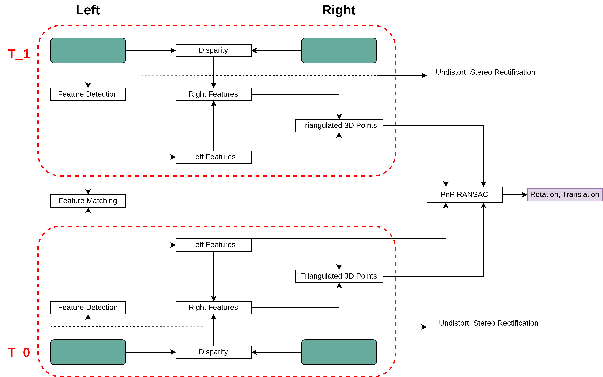

  <h1>Stereo Visual Odometry</h1>
  

`Stereo Visual Odometry` is a pivotal technology enabling precise motion estimation and 3D mapping for robots and autonomous vehicles. By harnessing information from paired cameras, it facilitates robust localization and mapping, essential for safe and efficient navigation in diverse environments. Its applications span robotics, autonomous driving, and augmented reality, driving advancements in perception systems crucial for real-world deployment. This has been a building block for SLAM algorithms.

This repository facilitates the extraction of odometry data from stereo camera setups.

## Table of Contents
1. [Odometry](#odometry)
2. [Stereo Vs Monocular](#stereo-setup)
3. [Algorithm](#algorithm)
    - [Stereo Rectification](#stereo-rectification)
    - [Disparity](#disparity)
    - [Feature Detection](#feature-extraction)
    - [Feature Matching](#feature-matching)
    - [Triangulation](#triangulation)
    - [Bundle Adjustment](#bundle-adjustment)
    - [Pose Estimation](#pose-estimation)
10. [Applications](#applications)
11. [Limitations](#limitations)

## Odometry 

Odometry is the use of data from sensors to estimate the change in pose (position and orientation) of a moving object over time. Visual odometry is a specific type of odometry that uses a vision sensor, such as a camera, as its primary source of data to estimate pose.

##  Stereo Vs Monocular 
Stereo vision uses two cameras to capture images from slightly different viewpoints, mimicking human eyes. Whereas, Monocular vision uses a single camera for capturing images.
1. **Depth Perception:** 
Stereo vision excels at accurate depth estimation due to the parallax effect (the slight shift in viewpoint between the cameras). Monocular vision relies on other cues like relative size, occlusion, and shading for depth perception, making it less accurate.
2. **Complexity:** 
Stereo vision requires more processing power due to the need to handle two camera feeds and perform calculations to determine depth. Monocular vision is simpler and requires less hardware.
3. **Cost:** 
Stereo systems are generally more expensive due to the additional camera and processing requirements. Monocular systems are more cost-effective.

## Algorithm 

The SVO algorithm works in a series of steps:

1. **Stereo Image Capture**: The process starts by capturing a pair of images simultaneously from the left and right cameras of the stereo rig. Consider we have `i_l, i_r` at time `t` & `i_l+1, i_r+1` at time `t+1`.

2. **Preprocessing: Undistortion and Stereo Rectification**:
   - *Undistortion*: Camera lenses can introduce distortion into captured images. This step corrects for any lens distortion present in the stereo images.
   - *Stereo Rectification*: Stereo rectification aims to transform the stereo images such that corresponding points in the 3D world lie on the same row across both images. This simplifies the feature matching process in the next step.

3. **Disparity**: The captured images are processed to compute the disparity between corresponding pixels in the left and right images. Disparity arises due to the slight difference in perspective between the two camera viewpoints. Higher disparity indicates points closer to the camera. Get Disparities `d, d+1` from stereo pair captured at time `t` & `t+1`.

4. **Feature Detection and Matching**:
   - *Feature Detection*: Distinctive features like corners, edges, or blobs are identified in left images from time `t` & `t+1`. 
   - *Matching*: Identified features in the above step are matched. Matching pairs are extracted w.r.t left images from time at `t` & `t+1`. Now, we have identical feature from left images.
   - *Estimating Right image features*: Considering baselength between two cameras, features from left camera and disparity map, we will estimate right images features from time `t`& `t+1`.

5. **Triangulation**: Using Projection matrices of left & right camera and features of left & right images, 3D points are estimated. Now, we have 3D points `p` & `p+1` from time `t` & `t+1`.

6. **Bundle Adjustment:** Bundle adjustment in SVO refines camera poses and 3D points by considering all data simultaneously. It minimizes reprojection error (difference between reprojected 3D points and actual image features). This iterative process improves accuracy and reduces drift in camera motion estimates.

6. **PnP (Perspective-n-Point) RANSAC**: This stage estimates the pose (position and orientation) of the camera that captured the right image relative to the camera that captured the left image. It leverages the 3D points reconstructed in the previous step and performs an optimization process to determine the transformation that best aligns the 3D points with their corresponding image observations. RANSAC (Random Sample Consensus) helps handle outliers in the feature correspondences.
---

    
    
<strong>SVO pipeline</strong>

<!-- ## Disparity

## Feature Detection

## Matching

## Triangulation

## Inlier detection -->

## Applications 

Stereo VO offers several advantages that make it valuable in various fields. Here are some key applications:

1. **Autonomous Vehicles:**
Stereo VO plays a crucial role in self-driving cars. It helps estimate the vehicle's movement (position and orientation) by analyzing camera images, providing valuable information for navigation and obstacle avoidance.

2. **Robotics:**
Robots use stereo VO for tasks like object manipulation, exploration, and path planning. By understanding their movement through visual cues, robots can interact with their environment more effectively.

3. **Augmented Reality(AR):**
AR applications utilize stereo VO to accurately register virtual objects onto the real world. Stereo cameras provide depth information, allowing for precise placement and interaction with virtual elements.

4. **Drone Navigation:**
Drones can leverage stereo VO for obstacle detection, terrain mapping, and autonomous flight. By estimating their motion based on visual data, drones can navigate complex environments safely.

5. **Virtual Reality(VR):**
Stereo VO can be used in VR systems to track head movements and improve the user's sense of immersion. The depth information helps create a more realistic and responsive virtual environment.

## Limitations 
While stereo VO offers benefits, it also comes with limitations:

1. **Computational Cost:**
Processing two camera streams and performing stereo matching algorithms can be computationally expensive, especially for real-time applications.

2. **Accuracy:**
Stereo VO accuracy depends on several factors, including camera calibration, lighting conditions, and scene texture. Repetitive patterns or low-texture environments can lead to inaccurate depth estimation.

3. **Sensor Limitations:**
Stereo cameras require a specific baseline (distance between cameras) for accurate depth calculation. Additionally, they can be susceptible to sensor noise.

4. **Outdoor Environments:**
Stereo VO can struggle in dynamic outdoor environments with changing lighting conditions  or fast movements.

5. **Global Localization:**
Stereo VO primarily focuses on relative motion estimation.  Without additional sensors like GPS, it can be difficult to determine the robot's absolute position in the world (global localization).

This project was inspired by research paper by Author et al. [[1] &nbsp;](#1).

## References

[1] &nbsp; A. Howard, "Real-time stereo visual odometry for autonomous ground vehicles," 2008 IEEE/RSJ International Conference on Intelligent Robots and Systems, Nice, France, 2008, pp. 3946-3952, doi: 10.1109/IROS.2008.4651147. [Link](https://ieeexplore.ieee.org/document/4651147)

[2] &nbsp; C. Forster, M. Pizzoli and D. Scaramuzza, "SVO: Fast semi-direct monocular visual odometry," 2014 IEEE International Conference on Robotics and Automation (ICRA), Hong Kong, China, 2014, pp. 15-22, doi: 10.1109/ICRA.2014.6906584. [Link](https://ieeexplore.ieee.org/document/6906584)

[3] &nbsp; C. Forster, Z. Zhang, M. Gassner, M. Werlberger and D. Scaramuzza, "SVO: Semidirect Visual Odometry for Monocular and Multicamera Systems," in IEEE Transactions on Robotics, vol. 33, no. 2, pp. 249-265, April 2017, doi: 10.1109/TRO.2016.2623335. [Link](https://ieeexplore.ieee.org/document/7782863)

[4] &nbsp; Nicolai Nielsen. Visual Odometry with a Stereo Camera: Step-by-Step Guide with OpenCV and KITTI Dataset. [Link](https://youtu.be/WV3ZiPqd2G4)

[5] &nbsp; Avi Singh. Visual Odometry from Scratch - A tutorial for beginners.[Link](https://avisingh599.github.io/vision/visual-odometry-full/)

[6] &nbsp; Robotics and Perception Group  [rpg_svo](https://github.com/uzh-rpg/rpg_svo.git)

[7] &nbsp; Nafees Bin Zaman. [Stereo Visual Odometry](https://github.com/NafBZ/Stereo-Visual-Odometry.git)

[8] &nbsp;Chirayu Garg. [Stereo Visual Odometry](https://github.com/cgarg92/Stereo-visual-odometry.git)

